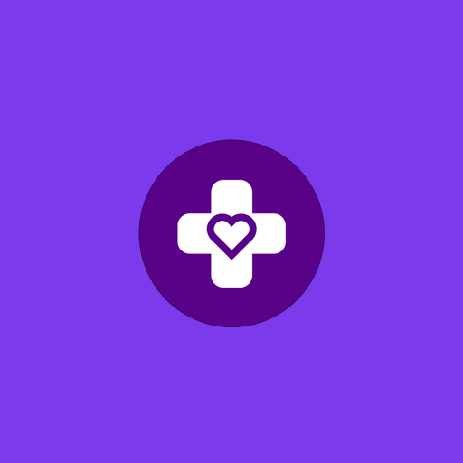

<!DOCTYPE html>
<html lang="en">
<head>
<meta charset="UTF-8">
<meta name="viewport" content="width=device-width, initial-scale=1.0">
<title>Love Care Global - README</title>

</head>
<body>

  
  <h1>Love Care Global</h1>
  
Compassionate Care, Without Borders.

  

    Global Care Agency
    PWA Ready
    MIT License
  

<h2>🌍 About Us</h2>

<strong>Love Care Global</strong> is a professional international caregiving platform connecting qualified, compassionate nurses and caregivers with families worldwide. We are not limited to Ghana — we serve clients across Africa, Europe, Middle East, and North America.

Our mission is to provide trusted, verified, and professional home care services with dignity and love.

<h2>✨ Features</h2>
<ul>
  <li>✅ <strong>Verified Nurses:</strong> National ID, Certificates & Video Profile Verification</li>
  <li>✅ <strong>Client Video Watch:</strong> Secure Cloudinary video streaming for client interviews</li>
  <li>✅ <strong>Global CDN:</strong> Fast loading worldwide - powered by Cloudinary</li>
  <li>✅ <strong>PWA Installable:</strong> Works like a native app on Android & iOS</li>
  <li>✅ <strong>Secure & Professional:</strong> Firebase Authentication & Firestore Database</li>
  <li>✅ <strong>Real-time Matching:</strong> Clients and caregivers connected instantly</li>
</ul>

  <h3 style="margin-top:0;">🔧 Tech Stack</h3>
  
<strong>Frontend:</strong> HTML5, CSS3, JavaScript (Single Page Application)

  
<strong>Backend:</strong> Firebase Firestore & Authentication

  
<strong>Media Storage:</strong> Cloudinary (Free 25GB - Global CDN)

  
<strong>PWA:</strong> manifest.json + sw.js (Service Worker)

<h2>📂 Project Structure</h2>
<pre style="background:#f5f5f5; padding:15px; border-radius:8px; overflow:auto;">
/ (root)
├── index.html # Main Application
├── real-index.html # Production Build
├── manifest.json # PWA Manifest
├── sw.js # Service Worker
├── Icon-192.png / Icon-512.png
├── privacy.html
├── terms.html
└── LICENSE
</pre>

<h2>🚀 Live Demo</h2>

Visit: <a href="https://lovecareglobal-cell.github.io/lovecare-global/">https://lovecareglobal-cell.github.io/lovecare-global/</a>

<h2>📧 Contact & Brand</h2>

This project is now officially managed by <strong>lovecareglobal-cell</strong>.

Email: <strong>lovecareglobal [at] gmail.com</strong> 
All system emails are sent as <strong>Love Care Global</strong> - professional brand identity.

<h2>📄 License</h2>

MIT License - See <a href="LICENSE">LICENSE</a> file.

Copyright © 2026 Love Care Global. All rights reserved.

  
Made with ❤️ by Love Care Global Team | Serving the World with Love

</body>
</html>
